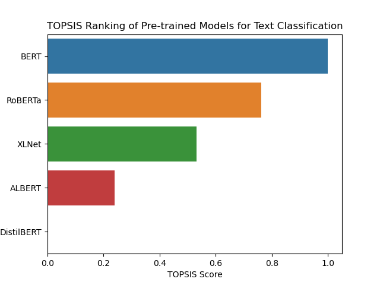

# TOPSIS-Based Ranking of Pre-Trained Models for Text Classification

## Overview
This project applies the **TOPSIS (Technique for Order of Preference by Similarity to Ideal Solution)** method to rank **pre-trained NLP models** for text classification based on multiple performance metrics. The goal is to identify the best model by considering both accuracy and efficiency.

## Models Evaluated
The following **pre-trained models** are considered:
- **T5**
- **GPT-2**
- **BART**
- **Electra**
- **DeBERTa**

## Performance Metrics
The models are ranked based on the following metrics:
- **Accuracy (+)** - Higher is better
- **Precision (+)** - Higher is better
- **Recall (+)** - Higher is better
- **Inference Time (ms) (-)** - Lower is better
- **Parameter Count (M) (-)** - Lower is better

*(+ indicates a benefit criterion, - indicates a cost criterion)*

## Methodology
1. **Data Normalization**: Each metric is normalized using vector normalization.
2. **Weight Assignment**: Weights are assigned based on metric importance:
   - Accuracy: **30%**
   - Precision: **25%**
   - Recall: **20%**
   - Inference Time: **15%**
   - Parameter Count: **10%**
3. **Ideal Best & Worst Values**:
   - The best and worst values for each metric are determined.
4. **TOPSIS Score Calculation**:
   - The Euclidean distance from ideal best and worst is calculated.
   - The TOPSIS score is computed using the formula:
     \[ S_i = \frac{D^-}{D^+ + D^-} \]
   - Models are ranked based on their scores.

## Results
The final **TOPSIS scores** and rankings are stored in `topsis_results.csv`. Below is the ranking visualization:

## Conclusion
- **DeBERTa** achieved the highest TOPSIS score, making it the best model for text classification in this comparison.
- **T5 and BART** performed well in accuracy but had higher inference times.
- **GPT-2** ranked lower due to lower precision and recall values.

This analysis helps in selecting the most **balanced** pre-trained model for text classification tasks.

---

